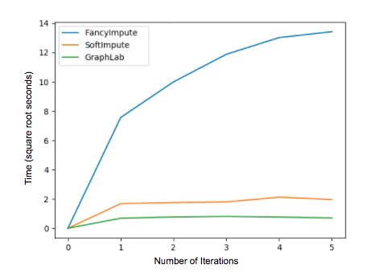

# sparseMF

SparseMF is a matrix factorization recommender written in Python, which runs on top of NumPy and SciPy. It was developed with a focus on speed, and highly sparse matrices. The package is available via pip.

Use SparseMF if you need a recommender that:

* Runs quickly using explicit recommender data
* Supports scipy sparse matrix formats
* Retains the sparsity of your data during training
 
## Algorithm 
This repo introduces two sparse matrix factorization algorithms. The algorithms were originally introduced by Trevor Hastie et al. in a 2014 paper ["Matrix Completion and Low-Rank SVD via Fast Alternating Least Squares"](https://stanford.edu/~rezab/papers/fastals.pdf) as an extention to SoftImpute, which was introduced in 2009. A sparse implementation of each of these algorithms is introduced here. Both borrow from the [FancyImpute](https://github.com/hammerlab/fancyimpute/tree/master/fancyimpute) python dense implementation of the 2009 SoftImpute algorithm. With large, sparse matrices, this version is significantly faster at predicting ratings for user/item pairs. To learn more about the differences between the two algorithms, [read Trevor Hastie's vignette](https://web.stanford.edu/~hastie/swData/softImpute/vignette.html).

## Getting Started

SparseMF is simple to use. First, install the package via pip:

```
pip install sparsemf
```

Next, choose the algorithm you would like to import, `SoftImpute` or `SoftImputeALS` and use it as follows:

```python
from sparsemf import SoftImpute

model = SoftImpute()
X = my_data
model.fit(X)
model.predict( [users], [items] )
```

## Relative Speed

Here is how the speed of SparseMF stacks up against GraphLab and FancyImpute:



## Other Package Contents

In addition to these 'SoftImpute' and 'SoftImputeALS', the package also includes:

* 'SPLR' - A new sparse matrix class, entitled Sparse Plus Low Rank (SPLR), as described in the 2009 paper ['Spectral Regularization Algorithms for Learning Large Incomplete Matrices'](https://web.stanford.edu/~hastie/Papers/mazumder10a.pdf).
* 'SBiScale' - A sparse approach to scaling and centering, row-wise and column-wise. 

This GitHub repo also includes:

* Unit tests for SoftImpute.
* Benchmarking for SoftImputeALS against GraphLab and the FancyImpute SoftImpute implementation.

## Resources

Here are some helpful resources:

1. [A Helpful Introduction to Matrix Factorization Recommenders](http://infolab.stanford.edu/~ullman/mmds/ch9.pdf).
2. [Benchmarks for MovieLens Dataset](https://sites.google.com/site/domainxz/benchmark).
3. [Trevor Hastie's Hybrid Implementation of Soft-Impute and ALS](https://arxiv.org/abs/1410.2596).

